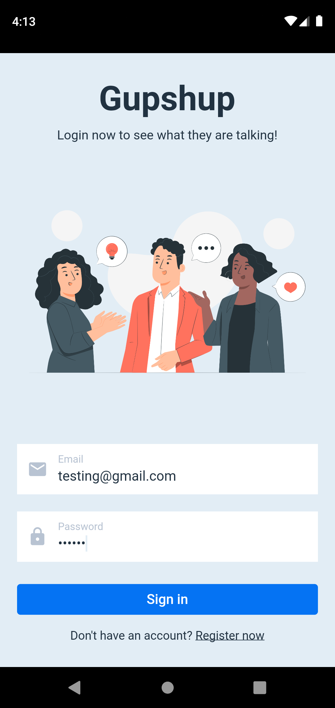
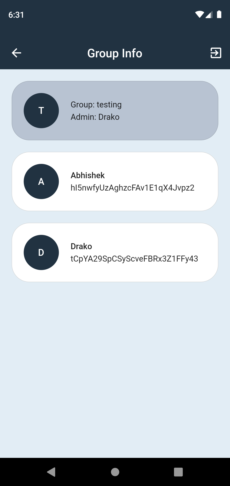
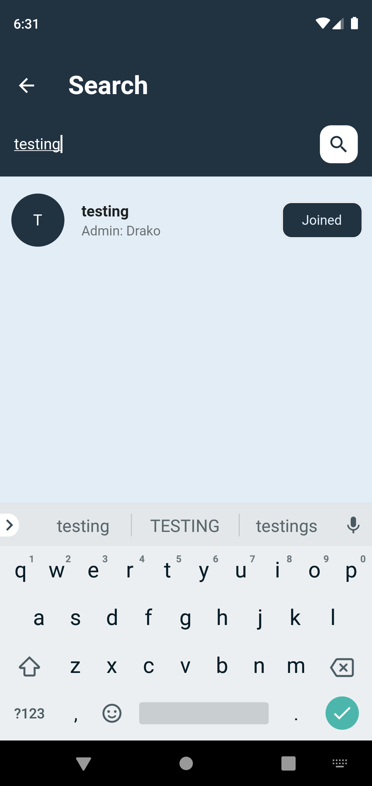

# GupShup Chat App

"GupShup" is a vibrant Flutter-based chatting application that brings people closer through seamless conversations. Powered by Firebase for robust backend support, it offers real-time messaging, secure user authentication, and cloud storage for multimedia sharing. With its user-friendly interface and dynamic features, "GupShup" makes connecting and chatting with friends a delightful experience.

[Downlaod the APP](https://drive.google.com/drive/folders/1GWm25Nqo6_ekGEjkX9iKD8ZOnXKY_1_d?usp=drive_link)

## Getting Started

### Step 1:
Download the app using the provided link above and below
[Downlaod the APP](https://drive.google.com/drive/folders/1GWm25Nqo6_ekGEjkX9iKD8ZOnXKY_1_d?usp=drive_link)
The screenshots is given inside the folder

### Step 2:
Install the app in your android device

- [Lab: Write your first Flutter app](https://docs.flutter.dev/get-started/codelab)
- [Cookbook: Useful Flutter samples](https://docs.flutter.dev/cookbook)

For help getting started with Flutter development, view the
[online documentation](https://docs.flutter.dev/), which offers tutorials,
samples, guidance on mobile development, and a full API reference.

## Screenshots

 
 
